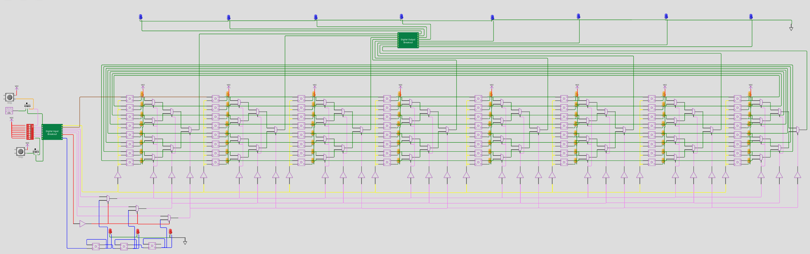

 

# 8x8 Bit Pattern Player

## TinyTapeout 02

This repository contains a mikrochip design done for TinyTapeout 02.
Go to https://tinytapeout.com for more informations.

This is a re-submission from TinyTapeOut 01. So the code in this project is a clone from the TT01 project (same wokwi ID).

## Wokwi project

https://wokwi.com/projects/341620484740219475

## Information about the design

author:       "Thorsten Knoll"

title:        "8x8 Bit Pattern Player"

description:  "8x8 bit serial programmable, addressable and playable memory."

__Important notice:__ The initial documentation had an error with swapping IN0 and IN1. This error got fixed in this repository here (README and info.yaml). But the automated TT02 docs might still have the wrong version. Below is the correct order of IN0 (clk_sr) and IN1 (data). Please keep this in mind when driving the pins.

how_it_works: "The 8x8 memory is a 64-bit shiftregister, consisting of 64 serial chained D-FlipFlops (clk_sr: IN0, data: IN1). 8 memoryslots of each 8 bit can be directly addressed via addresslines (3 bit: IN2, IN3, IN4) or from a clockdriven player (3 bit counter, clk_pl: IN7). A mode selector line (mode: IN5) sets the operation mode to addressing or to player. The 8 outputs are driven by the 8 bit of the addressed memoryslot."

how_to_test:  "Programm the memory: Start by filling the 64 bit shiftregister via data and clk_sr, each rising edge on clk_sr shifts a new data bit into the register. Select mode: Set mode input for direct addressing or clockdriven player. Address mode: Address a memoryslot via the three addresslines and watch the memoryslot at the outputs. Player mode: Each rising edge at clk_pl enables the next memoryslot to the outputs."

external_hw:  "You could programm, address and play the 8x8 Bit Pattern Player with a breadboard, two clock buttons and some dipswitches on the input side. Add some LED to the output side. Just like the WOKWI simulation."

language:     "wokwi"

wokwi_id:     341620484740219475

pictures:

inputs:
  * clk_sr
  * data
  * address_0
  * address_1
  * address_2
  * mode
  * none
  * clk_pl

outputs:
  * bit 0
  * bit 1
  * bit 2
  * bit 3
  * bit 4
  * bit 5
  * bit 6
